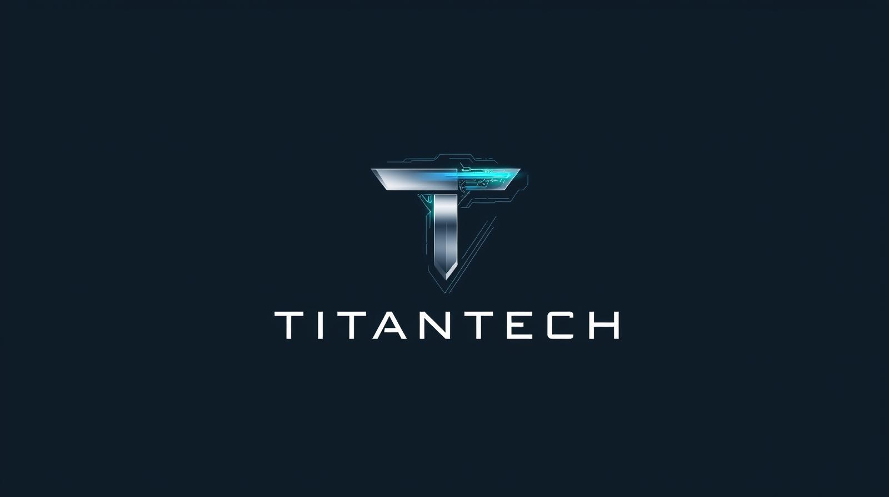

# TitanTech Style Guide

Complete visual theme and component library for consistent design across all bots and dashboards.

---

## Color Palette

### Primary Colors
```css
--primary-color: #D94FCB;      /* Neon Magenta - Main accent */
--secondary-color: #B830A0;    /* Darker Magenta */
--accent-color: #00CFFF;       /* Neon Blue - Secondary accent */
--neon-blue: #00CFFF;
--neon-magenta: #D94FCB;
```

### Background Colors
```css
--dark-color: #0D0D14;         /* Primary dark background */
--darker-color: #1A1A2B;       /* Secondary dark background */
--light-color: #f4f4f4;        /* Text color */
--bg-gradient: linear-gradient(135deg, #0D0D14 0%, #1A1A2B 100%);
```

### Semantic Colors
```css
--danger-color: #dc3545;       /* Red for errors/delete */
--success-color: #28a745;      /* Green for success */
--warning-color: #ffc107;      /* Yellow/Orange for warnings */
```

### Common Hex Values
- White text: `#e0e0e0`, `#f4f4f4`
- Gray text: `#aaa`, `#ccc`, `#a0a0a0`
- Dark inputs: `#252525`
- Borders: `#333`
- Black overlays: `rgba(0, 0, 0, 0.6)`, `rgba(0, 0, 0, 0.8)`

---

## Typography

### Font Families
```css
/* Import these fonts */
@import url('https://fonts.googleapis.com/css2?family=Exo:wght@300;400;500;600;700;800&family=Rajdhani:wght@300;400;500;600;700&family=Orbitron:wght@400;500;600;700;800;900&display=swap');

/* Primary font for body text */
font-family: 'Exo', 'Rajdhani', 'Segoe UI', Tahoma, Geneva, Verdana, sans-serif;

/* Headings and titles */
font-family: 'Orbitron', 'Exo', sans-serif;

/* Navigation and UI elements */
font-family: 'Rajdhani', sans-serif;

/* Code/monospace */
font-family: 'Courier New', monospace;
```

### Font Weights
- Light: 300
- Regular: 400
- Medium: 500
- Semibold: 600
- Bold: 700
- Extra Bold: 800

### Heading Styles
```css
h1, h2 {
    font-family: 'Orbitron', 'Exo', sans-serif;
    font-weight: 700-800;
    font-size: 2.5rem - 3rem;
    background: linear-gradient(45deg, var(--neon-blue), var(--neon-magenta));
    -webkit-background-clip: text;
    -webkit-text-fill-color: transparent;
    background-clip: text;
    text-shadow: 0 0 20px rgba(0, 207, 255, 0.5);
    text-transform: uppercase;
    letter-spacing: 2px;
}

h3 {
    font-family: 'Rajdhani', sans-serif;
    font-weight: 600;
    font-size: 1.6rem;
    color: var(--neon-blue);
    text-transform: uppercase;
    letter-spacing: 1px;
}
```

### Body Text
```css
p {
    font-size: 1rem - 1.2rem;
    font-family: 'Rajdhani', sans-serif;
    font-weight: 400;
    color: #e0e0e0;
    text-shadow: 0 0 10px rgba(255, 255, 255, 0.3);
}
```

---

## Header / Navigation

### Header Structure
```css
header {
    display: flex;
    justify-content: space-between;
    align-items: center;
    padding: 1rem 5%;
    background: linear-gradient(135deg, rgba(13, 13, 20, 0.95) 0%, rgba(26, 26, 43, 0.95) 100%);
    backdrop-filter: blur(10px);
    position: sticky;
    top: 0;
    z-index: 100;
    box-shadow: 0 2px 20px rgba(0, 207, 255, 0.2), 0 8px 32px rgba(0, 0, 0, 0.3);
    border-bottom: 1px solid rgba(0, 207, 255, 0.3);
    min-height: 70px;
}
```

### Logo
```css
.logo-container {
    display: flex;
    align-items: center;
}

.logo {
    height: 50px;
    margin-right: 10px;
}

.logo-container h1 {
    font-family: 'Orbitron', 'Exo', sans-serif;
    font-weight: 700;
    font-size: 1.5rem;
    margin-left: 15px;
    background: linear-gradient(45deg, var(--neon-blue), var(--neon-magenta));
    -webkit-background-clip: text;
    -webkit-text-fill-color: transparent;
    background-clip: text;
    text-shadow: 0 0 20px rgba(0, 207, 255, 0.5);
}
```

### Navigation Links
```css
.nav-links a {
    text-decoration: none;
    color: var(--light-color);
    font-weight: 600;
    font-family: 'Rajdhani', sans-serif;
    font-size: 0.85rem;
    transition: all 0.3s ease;
    position: relative;
    text-transform: uppercase;
    letter-spacing: 0.3px;
    padding: 0.5rem 0.3rem;
}

.nav-links a:hover {
    color: var(--neon-blue);
    text-shadow: 0 0 10px var(--neon-blue);
}

.nav-links a.active {
    color: var(--neon-magenta);
    text-shadow: 0 0 10px var(--neon-magenta);
}

.nav-links a.active::after {
    content: '';
    position: absolute;
    bottom: -5px;
    left: 0;
    width: 100%;
    height: 2px;
    background: linear-gradient(90deg, var(--neon-blue), var(--neon-magenta));
    box-shadow: 0 0 10px var(--neon-magenta);
}
```

### Login Button
```css
.login-btn {
    background: linear-gradient(45deg, var(--neon-magenta), var(--neon-blue));
    padding: 0.5rem 1rem;
    border-radius: 20px;
    color: white !important;
    display: flex;
    align-items: center;
    gap: 6px;
    font-family: 'Rajdhani', sans-serif;
    font-weight: 600;
    font-size: 0.85rem;
    text-transform: uppercase;
    letter-spacing: 0.5px;
    box-shadow: 0 0 20px rgba(217, 79, 203, 0.4);
    transition: all 0.3s ease;
}

.login-btn:hover {
    background: linear-gradient(45deg, var(--neon-blue), var(--neon-magenta));
    color: white !important;
    box-shadow: 0 0 30px rgba(0, 207, 255, 0.6);
    transform: translateY(-2px);
}
```

### Dropdown Menu
```css
.dropdown-menu {
    position: absolute;
    top: 100%;
    left: 50%;
    transform: translateX(-50%);
    background: linear-gradient(135deg, rgba(13, 13, 20, 0.98) 0%, rgba(26, 26, 43, 0.98) 100%);
    backdrop-filter: blur(10px);
    border: 1px solid rgba(0, 207, 255, 0.3);
    border-radius: 8px;
    min-width: 220px;
    box-shadow: 0 8px 32px rgba(0, 0, 0, 0.4), 0 0 20px rgba(0, 207, 255, 0.2);
    padding: 0.5rem 0;
}

.dropdown-menu a {
    display: block;
    padding: 0.8rem 1.5rem;
    color: var(--light-color);
    text-decoration: none;
    font-family: 'Rajdhani', sans-serif;
    font-size: 0.85rem;
    font-weight: 600;
    text-transform: uppercase;
    letter-spacing: 0.3px;
    transition: all 0.3s ease;
}

.dropdown-menu a:hover {
    background: rgba(0, 207, 255, 0.1);
    color: var(--neon-blue);
    text-shadow: 0 0 10px var(--neon-blue);
    padding-left: 2rem;
}

.dropdown-menu a:hover::before {
    content: '';
    position: absolute;
    left: 0;
    top: 50%;
    transform: translateY(-50%);
    width: 3px;
    height: 70%;
    background: linear-gradient(180deg, var(--neon-blue), var(--neon-magenta));
}
```

---

## Buttons

### Primary Button (CTA)
```css
.btn-primary, .cta-primary {
    background: linear-gradient(45deg, var(--neon-magenta), var(--neon-blue));
    color: white;
    padding: 1rem 2rem;
    border-radius: 30px;
    text-decoration: none;
    font-family: 'Rajdhani', sans-serif;
    font-weight: 600;
    font-size: 1.1rem;
    text-transform: uppercase;
    letter-spacing: 1px;
    transition: all 0.3s ease;
    box-shadow: 0 0 20px rgba(217, 79, 203, 0.4);
    border: none;
    cursor: pointer;
}

.btn-primary:hover, .cta-primary:hover {
    background: linear-gradient(45deg, var(--neon-blue), var(--neon-magenta));
    transform: translateY(-3px);
    box-shadow: 0 0 30px rgba(0, 207, 255, 0.6);
}
```

### Secondary Button
```css
.cta-secondary {
    background: linear-gradient(45deg, rgba(0, 207, 255, 0.2), rgba(217, 79, 203, 0.2));
    color: var(--neon-blue);
    border: 2px solid var(--neon-blue);
    padding: 1rem 2rem;
    border-radius: 30px;
    display: flex;
    align-items: center;
    gap: 8px;
    box-shadow: 0 0 15px rgba(0, 207, 255, 0.3);
    transition: all 0.3s ease;
}

.cta-secondary:hover {
    background: linear-gradient(45deg, var(--neon-blue), var(--neon-magenta));
    color: white;
    transform: translateY(-3px);
    box-shadow: 0 0 25px rgba(0, 207, 255, 0.5);
}
```

### Button Variants
```css
.btn-success {
    background-color: #4CAF50;
    color: white;
}

.btn-info {
    background-color: #2196F3;
    color: white;
}

.btn-warning {
    background-color: #FF9800;
    color: white;
}

.btn-danger {
    background-color: #f44336;
    color: white;
}

/* Common hover effect for all variants */
.btn:hover {
    transform: translateY(-2px);
    box-shadow: 0 4px 12px rgba(0, 207, 255, 0.4);
}
```

### Icon Button
```css
.btn-icon {
    background: rgba(0, 207, 255, 0.1);
    border: 1px solid var(--primary-color);
    color: var(--primary-color);
    padding: 8px 12px;
    border-radius: 6px;
    cursor: pointer;
    transition: all 0.3s ease;
}

.btn-icon:hover {
    background: rgba(0, 207, 255, 0.3);
    transform: translateY(-2px);
}
```

---

## Cards

### Feature Card
```css
.feature-card {
    background: linear-gradient(135deg, rgba(26, 26, 43, 0.8) 0%, rgba(13, 13, 20, 0.8) 100%);
    backdrop-filter: blur(10px);
    padding: 2.5rem;
    border-radius: 15px;
    box-shadow: 0 8px 32px rgba(0, 0, 0, 0.3), 0 0 20px rgba(0, 207, 255, 0.1);
    border: 1px solid rgba(0, 207, 255, 0.3);
    position: relative;
    overflow: hidden;
    text-align: center;
    transition: all 0.4s ease;
}

.feature-card::before {
    content: '';
    position: absolute;
    top: 0;
    left: 0;
    right: 0;
    height: 3px;
    background: linear-gradient(90deg, var(--neon-blue), var(--neon-magenta));
}

.feature-card:hover {
    transform: translateY(-10px);
    box-shadow: 0 0 40px rgba(0, 207, 255, 0.4),
                0 15px 40px rgba(0, 0, 0, 0.4),
                0 0 60px rgba(217, 79, 203, 0.2);
    border-color: var(--neon-blue);
}

.feature-card i {
    font-size: 3rem;
    background: linear-gradient(45deg, var(--neon-blue), var(--neon-magenta));
    -webkit-background-clip: text;
    -webkit-text-fill-color: transparent;
    background-clip: text;
    margin-bottom: 1.5rem;
    filter: drop-shadow(0 0 10px rgba(0, 207, 255, 0.5));
}
```

### Server Card
```css
.server-card {
    background-color: rgba(0, 0, 0, 0.6);
    border-radius: 10px;
    overflow: hidden;
    box-shadow: 0 4px 15px rgba(0, 0, 0, 0.2), 0 0 15px rgba(0, 207, 255, 0.1);
    transition: transform 0.3s ease, box-shadow 0.3s ease;
    border: 1px solid rgba(0, 207, 255, 0.2);
}

.server-card:hover {
    transform: translateY(-10px);
    box-shadow: 0 10px 25px rgba(0, 0, 0, 0.3),
                0 0 30px rgba(0, 207, 255, 0.3),
                0 0 50px rgba(217, 79, 203, 0.1);
    border-color: var(--neon-blue);
}
```

### Role Card (Custom Component)
```css
.role-card {
    background: linear-gradient(135deg, rgba(26, 26, 43, 0.8) 0%, rgba(13, 13, 20, 0.8) 100%);
    border: 1px solid rgba(0, 207, 255, 0.3);
    border-radius: 12px;
    padding: 1.5rem;
    margin-bottom: 1rem;
    transition: all 0.3s ease;
    cursor: move;
}

.role-card:hover {
    border-color: var(--primary-color);
    box-shadow: 0 0 20px rgba(0, 207, 255, 0.3);
    transform: translateY(-2px);
}
```

---

## Forms

### Input Fields
```css
input[type="text"],
input[type="number"],
input[type="email"],
input[type="password"],
textarea,
select {
    width: 100%;
    padding: 10px;
    background-color: #252525;
    border: 1px solid #333;
    color: #e0e0e0;
    border-radius: 6px;
    font-size: 14px;
    transition: all 0.3s ease;
}

input:focus,
textarea:focus,
select:focus {
    outline: none;
    border-color: var(--primary-color);
    box-shadow: 0 0 8px rgba(0, 207, 255, 0.3);
}
```

### Color Picker
```css
input[type="color"] {
    width: 120px;
    height: 50px;
    border: 2px solid rgba(255, 255, 255, 0.3);
    border-radius: 8px;
    cursor: pointer;
    background: transparent;
    transition: all 0.3s ease;
}

input[type="color"]:hover {
    border-color: var(--primary-color);
    box-shadow: 0 0 12px rgba(0, 207, 255, 0.4);
}
```

### Toggle Switch
```css
.switch {
    position: relative;
    display: inline-block;
    width: 45px;
    height: 24px;
}

.switch input {
    opacity: 0;
    width: 0;
    height: 0;
}

.slider {
    position: absolute;
    cursor: pointer;
    top: 0;
    left: 0;
    right: 0;
    bottom: 0;
    background-color: #ccc;
    transition: .4s;
    border-radius: 24px;
}

.slider:before {
    position: absolute;
    content: "";
    height: 18px;
    width: 18px;
    left: 3px;
    bottom: 3px;
    background-color: white;
    transition: .4s;
    border-radius: 50%;
}

input:checked + .slider {
    background-color: #4CAF50;
}

input:checked + .slider:before {
    transform: translateX(21px);
}
```

### Form Labels
```css
label {
    display: block;
    color: #e0e0e0;
    font-weight: 600;
    margin-bottom: 0.5rem;
    font-family: 'Rajdhani', sans-serif;
}
```

---

## Modals

### Modal Overlay
```css
.modal-overlay {
    display: none;
    position: fixed;
    top: 0;
    left: 0;
    width: 100%;
    height: 100%;
    background: rgba(0, 0, 0, 0.8);
    z-index: 10000;
    justify-content: center;
    align-items: center;
    overflow-y: auto;
}

.modal-overlay.active {
    display: flex;
}
```

### Modal Content
```css
.modal-content {
    background: linear-gradient(135deg, #1A1A2B 0%, #0D0D14 100%);
    border: 2px solid var(--primary-color);
    border-radius: 12px;
    padding: 2rem;
    max-width: 900px;
    width: 90%;
    max-height: 90vh;
    overflow-y: auto;
    box-shadow: 0 8px 32px rgba(0, 0, 0, 0.5), 0 0 20px rgba(0, 207, 255, 0.3);
    animation: modalSlideIn 0.3s ease-out;
}

@keyframes modalSlideIn {
    from {
        opacity: 0;
        transform: translateY(-50px);
    }
    to {
        opacity: 1;
        transform: translateY(0);
    }
}
```

### Modal Header
```css
.modal-header {
    display: flex;
    justify-content: space-between;
    align-items: center;
    margin-bottom: 2rem;
    padding-bottom: 1rem;
    border-bottom: 2px solid rgba(0, 207, 255, 0.3);
}

.modal-header h2 {
    color: var(--primary-color);
    margin: 0;
}

.close-btn {
    background: none;
    border: none;
    color: #aaa;
    font-size: 1.5rem;
    cursor: pointer;
    transition: color 0.3s;
}

.close-btn:hover {
    color: var(--primary-color);
}
```

---

## Sections

### Hero Section
```css
.hero {
    display: flex;
    align-items: center;
    justify-content: space-between;
    padding: 3rem 5%;
    min-height: 500px;
    background: linear-gradient(to right, rgba(13, 13, 20, 0.9), rgba(26, 26, 43, 0.7)), url('../images/banner.jpg');
    background-size: cover;
    background-position: center;
    position: relative;
}

.hero::before {
    content: '';
    position: absolute;
    top: 0;
    left: 0;
    right: 0;
    bottom: 0;
    background: linear-gradient(45deg, rgba(0, 207, 255, 0.1) 0%, rgba(217, 79, 203, 0.1) 100%);
    pointer-events: none;
}
```

### Features Section
```css
.features {
    padding: 4rem 5%;
    text-align: center;
    background: linear-gradient(135deg, rgba(26, 26, 43, 0.3) 0%, rgba(13, 13, 20, 0.3) 100%);
    backdrop-filter: blur(5px);
    border-top: 1px solid rgba(0, 207, 255, 0.2);
    border-bottom: 1px solid rgba(217, 79, 203, 0.2);
}
```

### Generator Intro Section
```css
.generator-intro {
    padding: 3rem 5%;
    text-align: center;
    background: linear-gradient(to right, rgba(0, 0, 0, 0.8), rgba(0, 0, 0, 0.4)), url('../images/community-bg.jpg');
    background-size: cover;
    background-position: center;
}
```

---

## Special Effects

### Gradient Text
```css
/* Use this for headings and important text */
background: linear-gradient(45deg, var(--neon-blue), var(--neon-magenta));
-webkit-background-clip: text;
-webkit-text-fill-color: transparent;
background-clip: text;
text-shadow: 0 0 20px rgba(0, 207, 255, 0.5);
```

### Neon Glow Effects
```css
/* Subtle glow */
box-shadow: 0 0 20px rgba(0, 207, 255, 0.2);

/* Medium glow */
box-shadow: 0 0 30px rgba(0, 207, 255, 0.4);

/* Strong glow */
box-shadow: 0 0 40px rgba(0, 207, 255, 0.6);

/* Multi-layer glow (cards on hover) */
box-shadow: 0 0 40px rgba(0, 207, 255, 0.4),
            0 15px 40px rgba(0, 0, 0, 0.4),
            0 0 60px rgba(217, 79, 203, 0.2);
```

### Backdrop Filter (Glassmorphism)
```css
backdrop-filter: blur(10px);
background: linear-gradient(135deg, rgba(13, 13, 20, 0.95) 0%, rgba(26, 26, 43, 0.95) 100%);
```

### Floating Animation
```css
@keyframes float {
    0% { transform: translateY(0); }
    50% { transform: translateY(-20px); }
    100% { transform: translateY(0); }
}

animation: float 3s ease-in-out infinite;
```

### Gradient Shift Animation
```css
@keyframes gradientShift {
    0% { background-position: 0% 50%; }
    50% { background-position: 100% 50%; }
    100% { background-position: 0% 50%; }
}

background: linear-gradient(135deg, #0D0D14 0%, #1A1A2B 50%, #2A1B3D 100%);
background-size: 400% 400%;
animation: gradientShift 8s ease infinite;
```

---

## Badges & Tags

### Basic Badge
```css
.badge {
    background: rgba(76, 175, 80, 0.2);
    color: #4CAF50;
    padding: 4px 10px;
    border-radius: 4px;
    font-size: 0.8rem;
    border: 1px solid #4CAF50;
}
```

### Info Box
```css
.info-box {
    background: rgba(76, 175, 80, 0.1);
    border: 1px solid #4CAF50;
    border-radius: 8px;
    padding: 1rem;
    margin-bottom: 1.5rem;
    color: #e0e0e0;
}

.info-box strong {
    color: #4CAF50;
}
```

---

## Footer

```css
footer {
    background-color: rgba(0, 0, 0, 0.9);
    padding-top: 2rem;
}

.footer-content {
    display: flex;
    flex-wrap: wrap;
    justify-content: space-between;
    padding: 0 5%;
    margin-bottom: 2rem;
}

.footer-bottom {
    text-align: center;
    padding: 1rem 0;
    border-top: 1px solid #333;
}

.social-icons a {
    color: var(--light-color);
    font-size: 1.5rem;
    transition: color 0.3s ease;
}

.social-icons a:hover {
    color: var(--primary-color);
}
```

---

## Code Preview Box

```css
.preview-section {
    background: rgba(0, 0, 0, 0.6);
    border: 1px solid rgba(0, 207, 255, 0.3);
    border-radius: 12px;
    padding: 2rem;
    margin-top: 2rem;
}

.preview-section pre {
    background-color: #1e1e1e;
    padding: 1.5rem;
    border-radius: 8px;
    overflow-x: auto;
    color: #e0e0e0;
    font-family: 'Courier New', monospace;
    font-size: 14px;
    line-height: 1.6;
    max-height: 500px;
    overflow-y: auto;
}
```

---

## Responsive Breakpoints

```css
/* Tablet */
@media (max-width: 1024px) {
    /* Adjust layouts to stack vertically */
}

/* Mobile */
@media (max-width: 768px) {
    /* Mobile menu, smaller text, stacked layouts */
}

/* Small mobile */
@media (max-width: 480px) {
    /* Extra small adjustments */
}
```

---

## Icon Usage

**Font Awesome 6.0.0** is used throughout.

Common icons:
- `<i class="fas fa-plus"></i>` - Add/Create
- `<i class="fas fa-edit"></i>` - Edit
- `<i class="fas fa-trash"></i>` - Delete
- `<i class="fas fa-download"></i>` - Download
- `<i class="fas fa-upload"></i>` - Upload
- `<i class="fas fa-copy"></i>` - Copy
- `<i class="fas fa-cog"></i>` - Settings
- `<i class="fas fa-sign-in-alt"></i>` - Login
- `<i class="fas fa-chevron-down"></i>` - Dropdown arrow
- `<i class="fab fa-discord"></i>` - Discord social

---

## Quick Start Template

```html
<!DOCTYPE html>
<html lang="en">
<head>
    <meta charset="UTF-8">
    <meta name="viewport" content="width=device-width, initial-scale=1.0">
    <title>Your Bot Name - TitanTech</title>
    <link rel="stylesheet" href="css/style.css?v=1.4">
    <link rel="stylesheet" href="https://cdnjs.cloudflare.com/ajax/libs/font-awesome/6.0.0/css/all.min.css?v=1.1">
</head>
<body>
    <header>
        <div class="logo-container">
            
            <h1>TitanTech</h1>
        </div>
        <nav>
            <ul class="nav-links">
                <li><a href="index.html" class="active">Home</a></li>
                <!-- Add more nav items -->
                <li><a href="login.html" class="login-btn">
                    <i class="fas fa-sign-in-alt"></i> Login
                </a></li>
            </ul>
            <div class="hamburger">
                <div class="line"></div>
                <div class="line"></div>
                <div class="line"></div>
            </div>
        </nav>
    </header>

    <main>
        <!-- Your content here -->
    </main>

    <footer>
        <div class="footer-bottom">
            <p>&copy; 2025. Not affiliated with Path of Titans.</p>
        </div>
    </footer>

    <script src="js/main.js"></script>
</body>
</html>
```

---

## CSS File Structure

Your main `style.css` should include:

1. Font imports
2. CSS Variables (`:root`)
3. Global reset (`*`)
4. Body styles
5. Header/Navigation
6. Hero sections
7. Cards & Components
8. Buttons
9. Forms
10. Modals
11. Footer
12. Responsive media queries

---

## Design Principles

1. **Neon Cyberpunk Aesthetic** - Heavy use of cyan/magenta gradients with dark backgrounds
2. **Glassmorphism** - Backdrop blur effects with semi-transparent backgrounds
3. **Smooth Transitions** - All interactive elements use `transition: all 0.3s ease`
4. **Hover Effects** - Elements lift up (`translateY(-2px to -10px)`) and glow on hover
5. **Gradient Accents** - Primary headings and CTA buttons use dual-color gradients
6. **Shadow Layers** - Multiple box-shadows for depth and glow effects
7. **Uppercase UI Text** - Navigation and buttons use uppercase with letter-spacing

---

This style guide contains all the visual patterns, colors, typography, and components used in TitanTech. Apply these consistently across all your bot dashboards for a unified brand experience.
